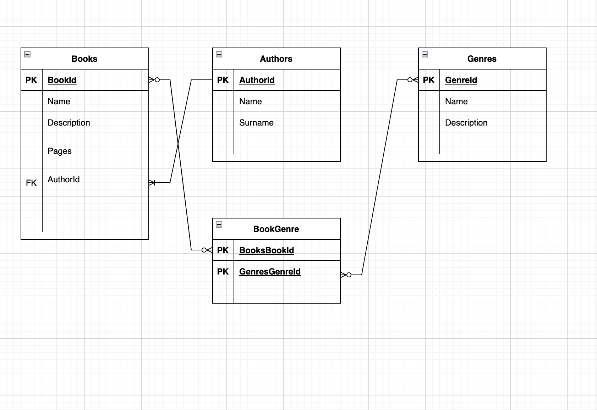
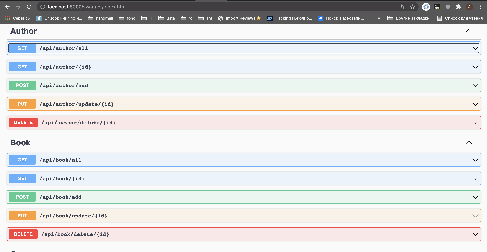
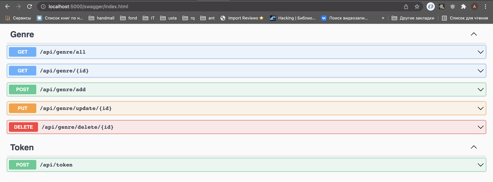

# BookStore

The scenario is:
- Books have many Genres.
- Genres have many Books.
- Authors have many Books.

So we have a **one-to-many** relasionship between *Authors* and *Books* and a **many-to-many** relationship between *Books* and *Genres*.

For secure Authors use JWT token
username: bookstore_user
password: BookSt0re9876

## Swagger
http://localhost:5000/swagger/index.html

